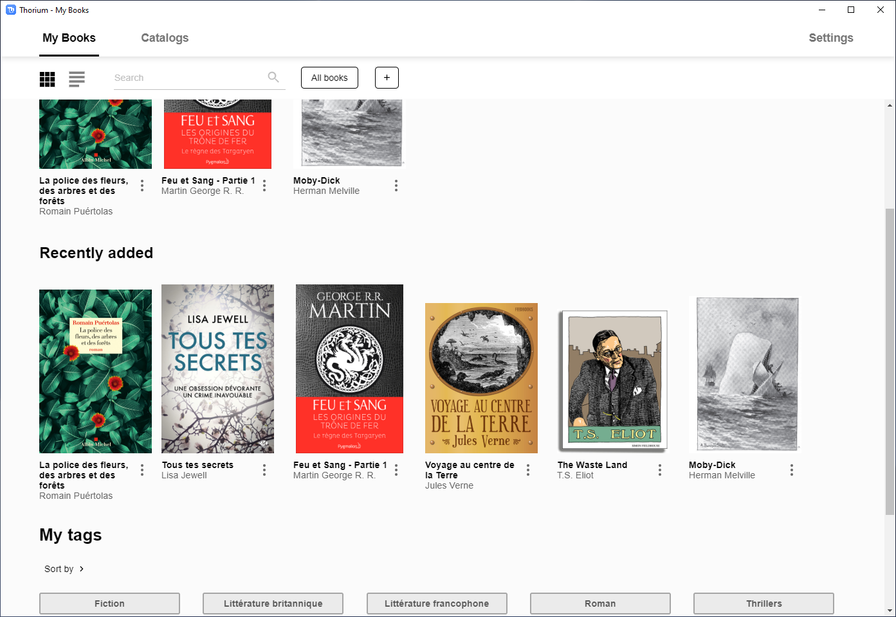
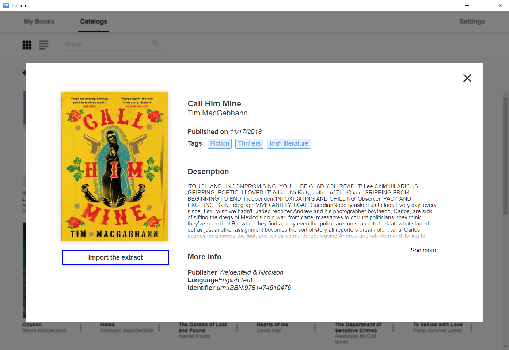
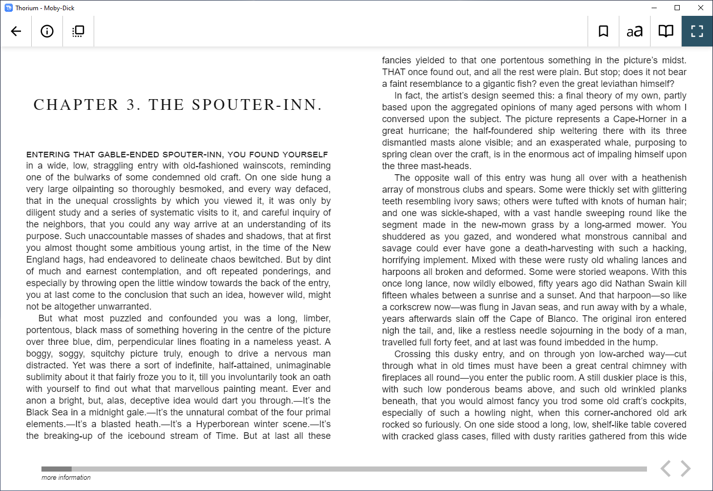
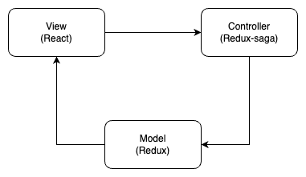
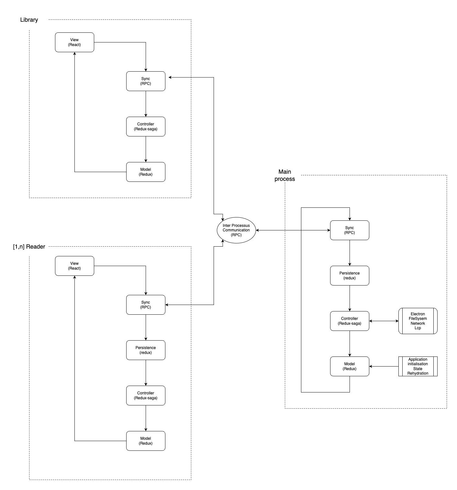
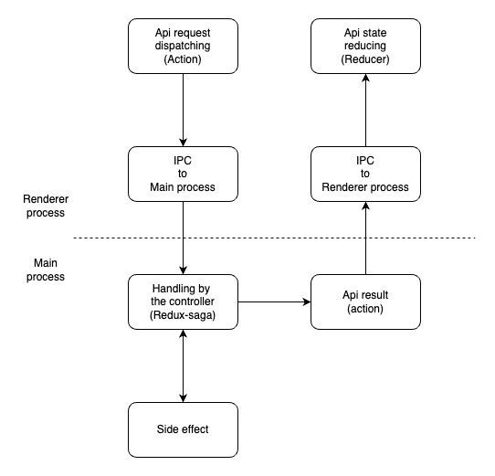

# Thorium Reader

Thorium Reader is an easy to use EPUB reading application for Windows 10/10S, MacOS and Linux. After importing e-books from a directory or OPDS feed, you'll be able to read on any screen size, customize layout settings, navigate via the table of contents or page list, set bookmarks ... A great care is taken to ensure the accessibility of the application for visual impaired people using NVDA, JAWS or Narrator.

Free application. No ads. No private data flowing anywhere.

This project is in constant evolution, corrections and new features will be added soon and your support is welcome for that. The application is based on the open-source Readium Desktop toolkit.

It is currently localized in following 25 languages:

* (en) English
* (fr) Français (French)
* (fi) Suomi (Finnish)
* (de) Deutsch (German)
* (es) Español (Spanish)
* (nl) Nederlands (Dutch)
* (ja) 日本語 (Japanese)
* (ka) ქართული (Georgian)
* (lt) Lietuvių (Lithuanian)
* (pt-BR) Português Brasileiro (Portuguese - Brazil)
* (pt-PT) Português (Portuguese - Portugal)
* (zh-CN) 简体中文 - 中国 (Simplified Chinese - China)
* (zh-TW) 繁體中文 - 台灣 (Traditional Chinese - Taiwan)
* (it) Italiano (Italian)
* (ru) Русский (Russian)
* (ko) 한국어 (Korean)
* (sv) Svenska (Swedish)
* (ca) Catalan
* (gl) Galician
* (eu) Euskadi (Basque)
* (el) ελληνικός (Greek)
* (bg) български (Bulgarian)
* (hr) Hrvatski (Croatian)
* (da) Dansk (Danish)
* (sl) Slovenščina (Slovene)

See: https://github.com/edrlab/thorium-reader/wiki/Localization-(l10n)-language-translations





## Prerequisites

1) NodeJS 18 (check with `node --version`)
2) NPM 9 (check with `npm --version`)

## Technologies

* typescript
* electron
* reactjs
* redux
* saga
* i18next

## Quick start

### Install dependencies

* `npm install` (or `npm ci`): initialize local `node_modules` packages from dependencies declared in `package.json` (this will also automatically call a long-running compilation stage in `npm run postinstall`)
* in case of failure to NPM "install" because of "Divina player" SHA integrity mismatch, please try running the following command in your shell: `node scripts/package-lock-patch.js && cat package-lock.json | grep -i divina-player-js`

### Start application in development environment

(with hot-reload dev server, web inspectors / debuggers)

* `npm run start:dev` (or `npm run start:dev:quick` to bypass TypeScript checks / launch the app faster)

### Start application in production environment

* `npm start` (or `npm run start`)

## Build installers

* `npm run package:win` or `npm run package:mac` or `npm run package:linux`

Code Signing information: https://github.com/edrlab/thorium-reader/wiki/Code-Signing

## Proxy server support

The `HTTPS_PROXY`, `HTTP_PROXY`, and `NO_PROXY` environment variables are used to configure the behavior of a client application when making HTTP or HTTPS requests through a proxy server.

- `HTTPS_PROXY`: Specifies the proxy server to use for HTTPS requests. The value should be in the format http://proxy.example.com:8080.
- `HTTP_PROXY`: Specifies the proxy server to use for HTTP requests. The value should be in the format http://proxy.example.com:8080.
- `NO_PROXY`: Specifies a comma-separated list of hostnames or IP addresses that should not be proxied. This is useful for excluding local or intranet addresses from being proxied.

When these environment variables are set, the client application will automatically use the specified proxy server for HTTP or HTTPS requests, unless the request is for a hostname or IP address listed in the NO_PROXY variable.

we used `proxy-agent` package from `TooTallNate` (https://github.com/TooTallNate/proxy-agents/tree/main/packages/proxy-agent)

see https://www.npmjs.com/package/proxy-from-env#environment-variables for more information.

## LCP support in Thorium Reader

Thorium Reader supports LCP-protected publications via an additional software component which is not available in this open-source codebase. When Thorium Reader is compiled from the open-source code without the additional production-grade library, the application can only load publications protected with the LCP "Basic Encryption Profile". For example, licenses generated by the open-source LCP server written in Go, without the patch that enables production-grade LCP Encryption Profiles.

In order to create a production-grade LCP-compliant variant / derivation of Thorium Reader (known as a "fork"), additional confidential software components and processes must be integrated in the custom application's build / release workflow. This represents a non-trivial amount of time and effort, as well as close collaboration between the fork's development team and EDRLab's technical staff. To cover operational costs, EDRLab charges a maintenance fee. Feel free to contact EDRlab to discuss your requirements.

## Command line

```
thorium <cmd> [args]

Commands:
  thorium opds <title> <url>  import opds feed
  thorium import <path>       import epub or lpcl file
  thorium read <title>        searches already-imported publications with the
                              provided TITLE, and opens the reader with the
                              first match
  thorium [path]              import and read an epub or lcpl file     [default]
  thorium completion          generate bash completion script

Positionals:
  path  path of your publication, it can be an absolute, relative path  [string]

Options:
  --version  Show version number                                       [boolean]
  --help     Show help                                                 [boolean]
```

## [DEV] Architecture

Thorium-reader is composed of 3 parts:
- One node.js main process (electron back-end)
- One library window (chromium renderer)
- One to N reader window(s) (chromium renderer)

Each part runs a model-controller and a view for the renderer process.

- the model is a state container with [Redux](https://redux.js.org/). It's based on [flux architecture](https://github.com/facebookarchive/flux)
- the controller is a middleware from Redux named [Redux-saga](https://redux-saga.js.org/). It handles all side effects and application behaviour.
- the view for the rendering is React with [class components](https://legacy.reactjs.org/docs/components-and-props.html)

To link these 3 parts we use:
- IPC/RPC: we use an implementation from [Electron](https://www.electronjs.org/docs/latest/api/ipc-main)
- React/Redux: We use [connect](https://react-redux.js.org/api/connect) from [react-redux](https://react-redux.js.org/).

### Diagram

#### [Model View Controller Architecture](https://en.wikipedia.org/wiki/Model%E2%80%93view%E2%80%93controller)





### API Concept

To have a POST request from a renderer process to the main process, we use the notion of API.
It's not an http API but an RPC encapsuled one, to redux/redux-saga logic with Action and Reducer.

Here is a diagram of the communication:



Src:
- src/main/redux/sagas/api/api.ts
- src/common/redux/actions/api/index.ts
- src/renderer/common/redux/reducers/api.ts

At the moment there are 17 API endpoints from (src/main/redux/sagas/api):

library:
- apiapp:
  - apiapp/search : search a library from apiapp protocol
- browser:
  - httpbrowser/browse : browse and parse an opds URL
- opds:
  - opds/getFeed : get an opdsFeed with its identifier
  - opds/findAllFeed: get all opdsFeed saved
  - opds/deleteFeed: delete an opdsFeed with its identifier
  - opds/addFeed: add an opdsFeed
  - opds/getUrlWithSearchLinks: get the search URL from an opdsFeed
- publication: (src/common/api/interface/publicationApi.interface.ts)
  - publication/get: get a publicationView from id
  - publication/delete: delete a publicationView from id
  - publication/findAll: get all publicationView
  - publication/findByTag: get all publicationView from a specific tag string
  - publication/updateTags: update tags list from a publication
  - publication/importFromLink: import a publication from an URL
  - publication/importFromFs: import a publication from a fileSystem path
  - publication/search: search publication from a query text
  - publication/searchEqTitrle: search publication by title matching
  - publication/exportPublication: export publication to the fileSystem


### ACTION-REDUCER

From the main-process to the renderer-process, or from the renderer-process to the main-process.

List of all Actions in place (src/common/redux/actions):

- auth: opds authentication
  - cancel
  - done
  - wipeData
- catalog
  - getCatalog: ask to rehydrate catalogView in the libraryState
  - setCatalogView: response from getCatalog
  - setTagView: rehydrate tagStringView in the libraryState
- dialog: modal dialog view in library,reader
  - closeRequest
  - openRequest
  - updateRequest
- download: download queue in library
  - abort
  - done
  - progress
- history: history opds feed
  - pushFeed
  - refresh
- i18n
  - setLocale
- import
  - verify: import verification process
- keyboard: keyboard shortcut
  - reloadShortcut
  - setShortcut
  - showShortcut
- lcp
  - renewPublication
  - returnPublication
  - unlockPublicationWithPassphrase
  - userKeyCheckRequest
- load: main proceess busy or not
  - busy
  - iddle
- net (not used)
- reader
  - attachMode
  - clipboardCopy
  - closeRequest
  - closeRequestFromPublication
  - configSetDefault
  - detachModeRequest
  - detachModeSuccess
  - fullScreenRequest
  - openRequest
  - openError
  - setReduxState: trigger app persistence
- session: saved session
  - enable
- toast: toast notification library,reader
  - close
  - open
