# test-suite 

Thorium test suite 


## test 1 / library open with wizard welcome screen

- name: open library window

- platforms: win

- version: 3.4

- goal: open electron library browser window

- prerequisite: 

  - appData cleared

- steps: 

  * start thorium

- expected result:

  welcome screen Thorium 3.4


- post steps: 
  - click on Don't show again
    - 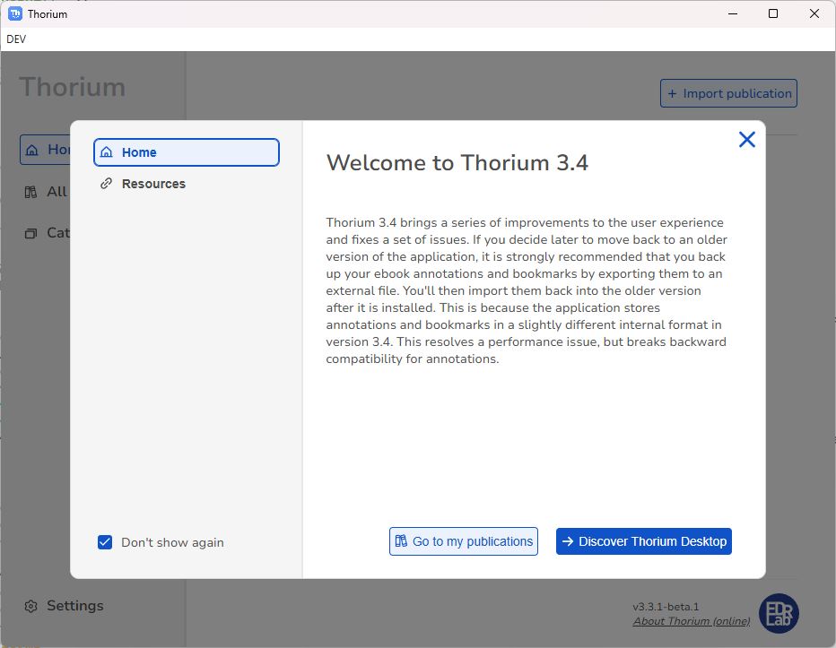
  - click on Go to my publication
- expected results: 

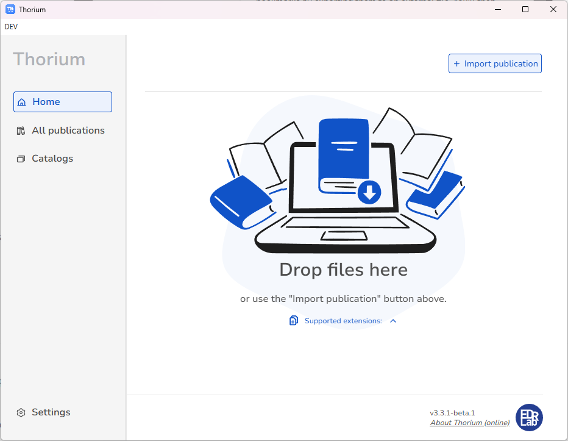


## test 2 / library menu navigation

- prerequisite: Test1
- steps:
  - start thorium

- expected result:
  - All publications
    -  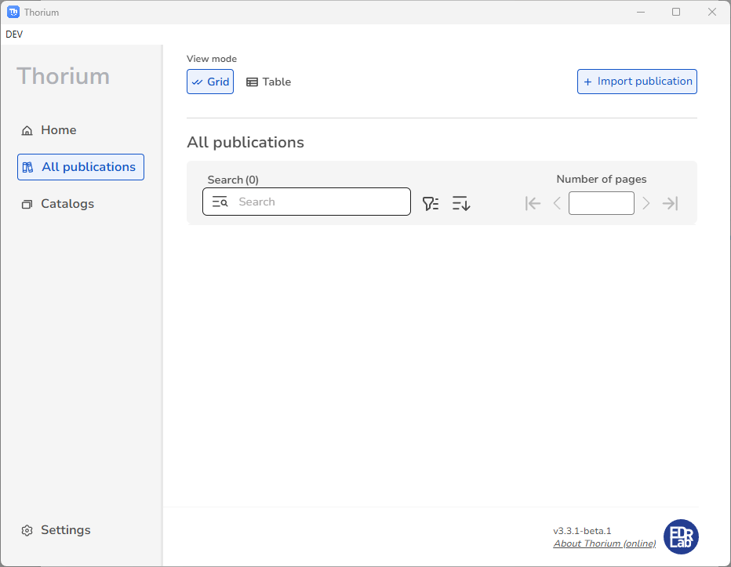
  - All catalogs
    -  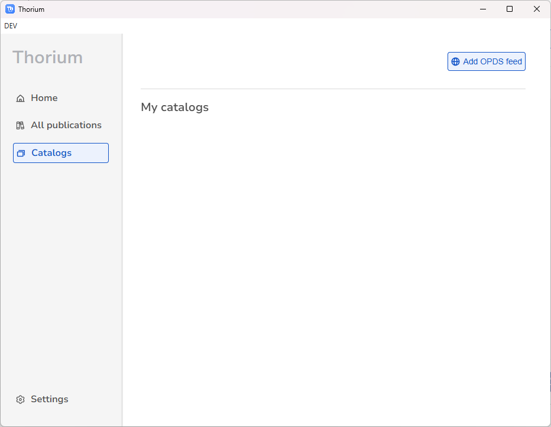
  - Settings
    - 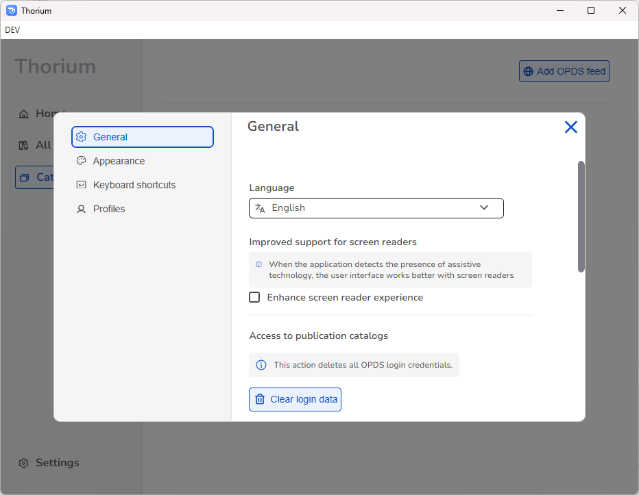


## test3 / library home "import a publication"

- prerequisite: 

  - Test1
  - [accessible_epub_3.epub](accessible_epub_3.epub) 

- steps:

  -  click on "import publication"
  - select accessible epub3 epub file

- expected result:

  - import the publication

    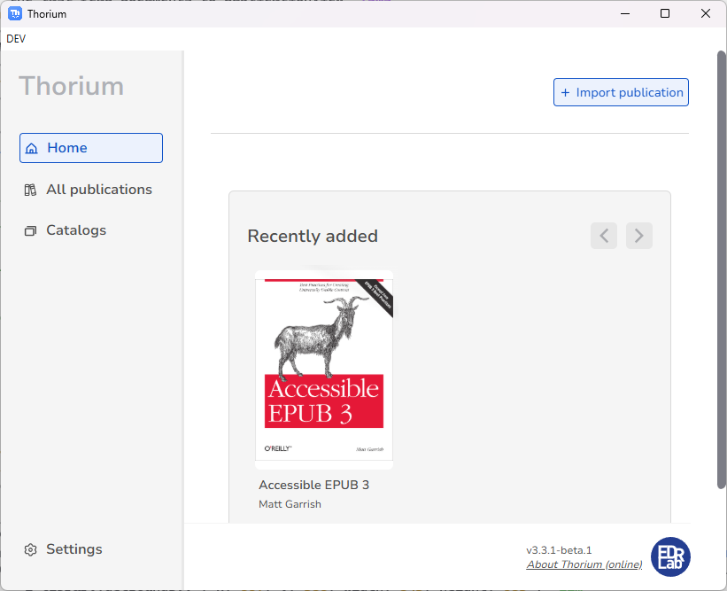

## test4 / publication catalog menu

- prerequisite: 
  - Test3
- steps:
  - click on the publication catalog menu icon (3 vertical small points)
- expected result:
  - catalog menu overlay

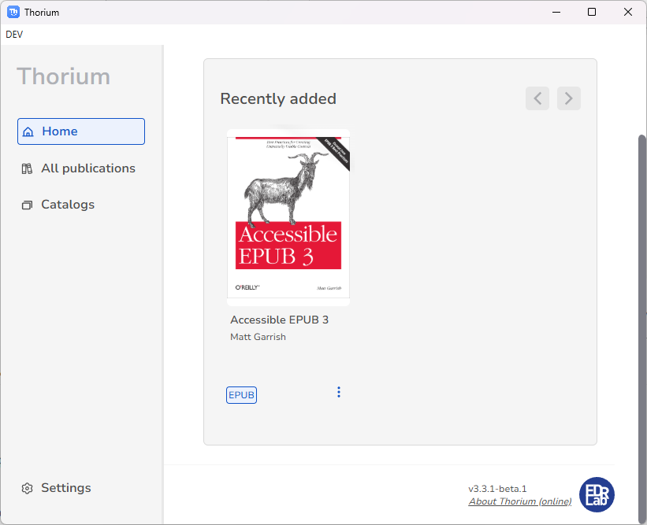


## test5 / library about publication modal

- prerequisite: 
  - Test4
- steps:
  - click on "About publication"

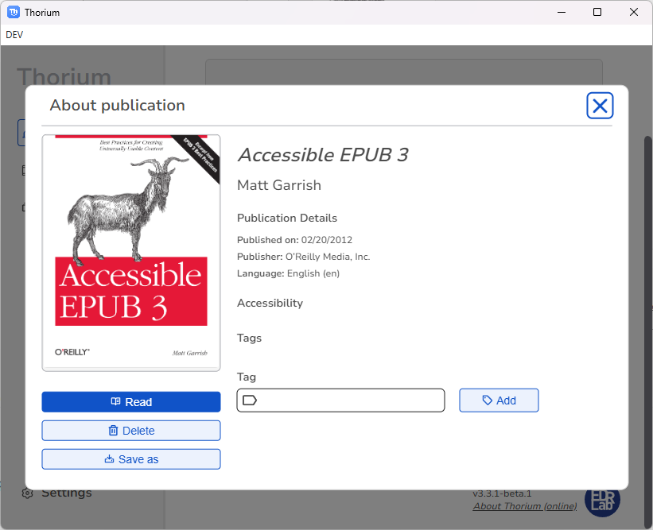


## test6 / library about publication / read

- prerequisite: 

  - Test5

- steps:

  - click on "Read"

- expected result:

  - open the reader browser window

    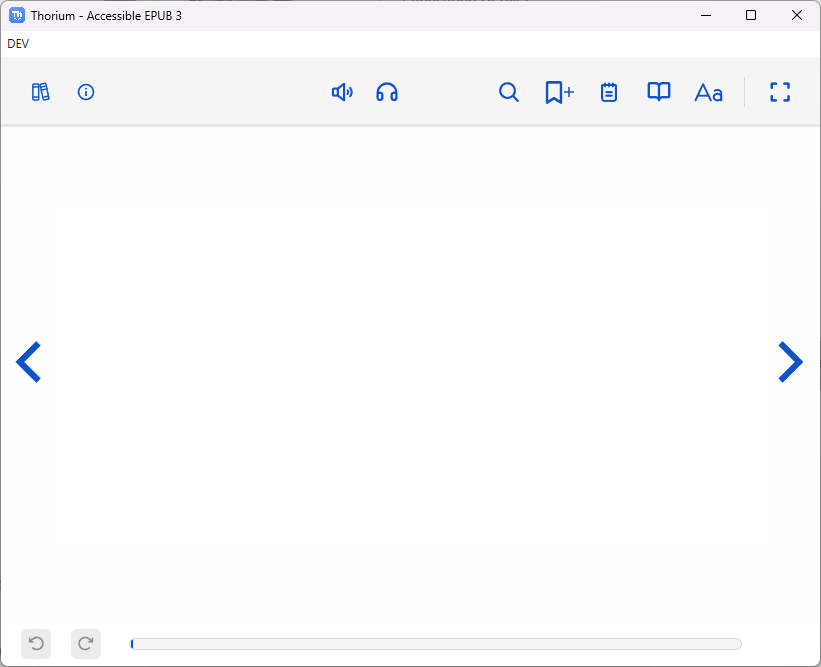

  - library window is still open in background


## test7 / library about publication / delete

- prerequisite: 

  - Test5

- steps:

  - click on "Delete"

    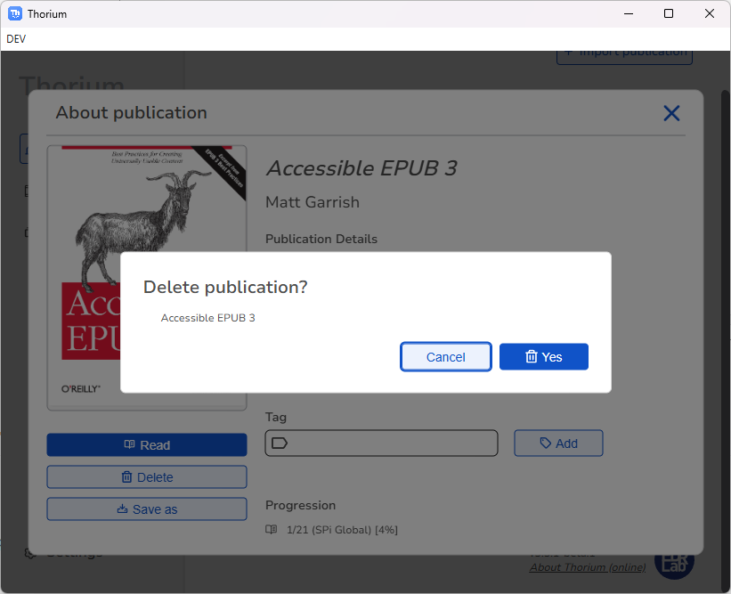

- expected results:

  - Click on Cancel dismiss the Delete publication modal and do nothing
  - Click on Yes remove the publication and come back to home library
    - v


## test8 / library about publication / save as

- prerequisite: 
  - Test5
- steps:
  - click on "save as"
- expected results: 
  - open the file explorer to export the publication to a specific file pathname
  - select a temporary directory
  - export the publication
  - check if the publication is exported to the disk


## test9 / library catalog menu / delete

- prerequisite: 
  - Test4
- steps:
  - click on "delete"

- expected results: 
  - same expected results as test7 


## test10 / library catalog menu / save as

- prerequisite: 
  - Test4
- steps:
  - click on "save as"

- expected results: 
  - same expected results as test8


## test11 / library all publications / one publication

- prerequisite: 
  - Test3
- steps:
  - click on "All publication" on the left menu section
- expected results:
  - 


## test12 / library all publications 

- prerequisite: 
  - Test11
- steps:
  - click on the catalog menu of the publication
- expected results:
  - same as Test4 catalog menu tests


## test13 / library all publications table view

- prerequisite: 

  - Test11

- steps:

  - click on Table on the top menu, grid must be selected by default

- expected results:

  - same as Test4 catalog menu tests

    


## test15 / one reader with "accessible epub3" opened

- prerequisite: 

  - Test3

- steps:

  - click on the accessible epub 3 publication cover

- expected result:

  - open the reader browser window with the library window in background hided by the reader window

    


## test16 / reader back to bookshelf

- prerequisite: 
  - Test15
- steps:
  - click on the back to bookshelf menu button


-  expected result:
  - close the reader and focus on library window


## test17 / reader publication info


- prerequisite: 

  - Test15

- steps:

  - click on the publication info icon in top left corner

- expected results:

  - publication info modal

    

## test18 / reader start tts

- prerequisite: 
  - Test15
- steps:
  - click on the activate tts icon in top middle
- expected results:
  - display tts buttons in place of activate tts icon 


## test19 / reader tts options

- prerequisite: 
  - Test15
- steps:
  - click on the options tts icon in top middle
- expected results:
  - display tts options overlay menu
  - 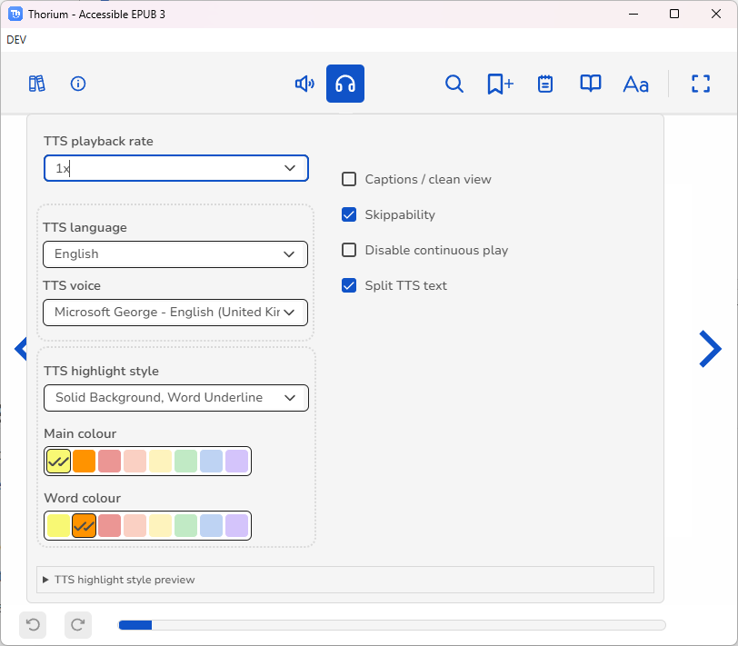


## test20 / reader search publication

- prerequisite: 
  - Test15
- steps:
  - click on the search publication icon in top right
- expected results:
  - display search bar on top of the publication content
  - 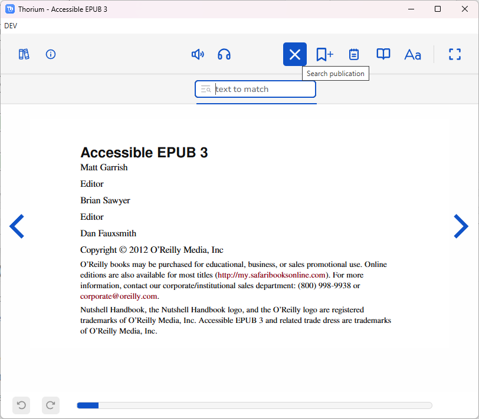


## test21 / reader bookmark

- prerequisite: 
  - Test15
- steps:
  - click on the bookmark icon in top right
- expected results:
  - bookmark the first locator position on the publication content 
  - 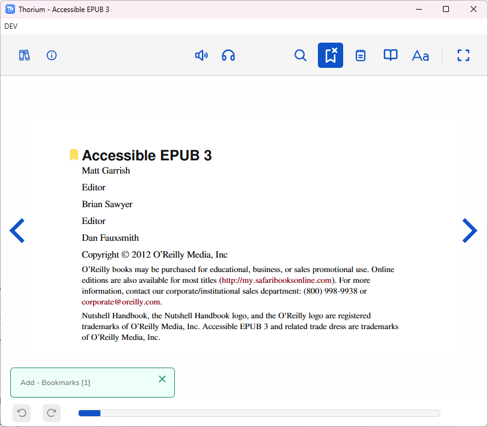


## test22 / reader note

- prerequisite: 
  - Test15
- steps:
  - click on the note icon in top right
- expected results:
  - dispatch a toast error notification with "no selection"
  - 


## test23 / reader navigation


- prerequisite: 
  - Test15
- steps:
  - click on the navigation icon in top right
- expected results:
  - open the navigation modal 
  - 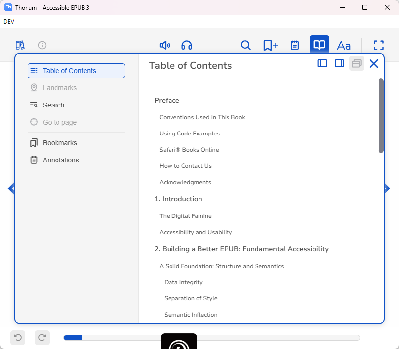


## test24 / reader settings

- prerequisite: 
  - Test15
- steps:
  - click on the settings icon in top right
- expected results:
  - open the navigation modal 
  - 


## test25 / reader locator change

- prerequisite: 
  - Test18
- steps:
  - click on the right arrow

- expected results:
  - page change
  - 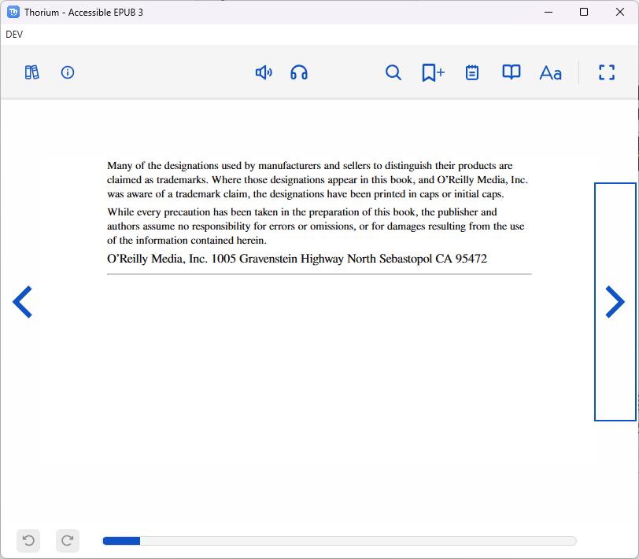


## test26 / reader locator persistence

- prerequisite: 
  - Test25
- steps:
  - close the reader
  - click on the publication cover - open the reader

- expected results:
  - locator didn't change and stay on the same previous page
  - 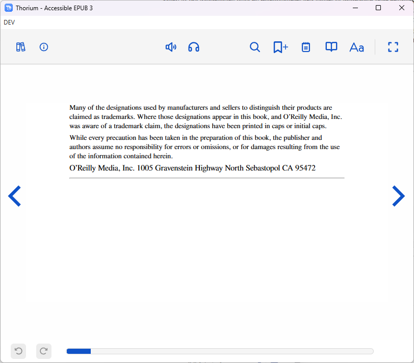


## test27 / reader settings theme change

- prerequisite: 
  - Test24
- steps:
  - select sepia theme
  - close the settings modal

- expected results:
  - theme change to sepia
  - 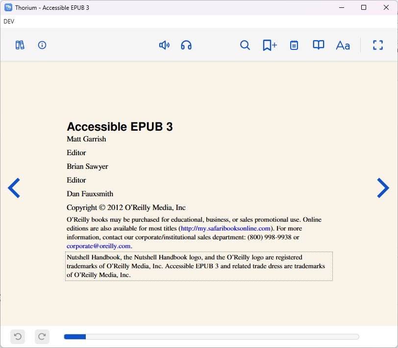

## test29 / reader settings theme persistence

- prerequisite: 
  - Test27
- steps:
  - close the reader

- expected results:
  - theme didn't change and stay on sepia
  - 


## test30 / reader settings customize text formatting

- prerequisite: 
  - Test15
- steps:
  - open the settings modal
  - check "customize text formatting"

- expected results:
  - Text and Spacing menu section enabled 
  - 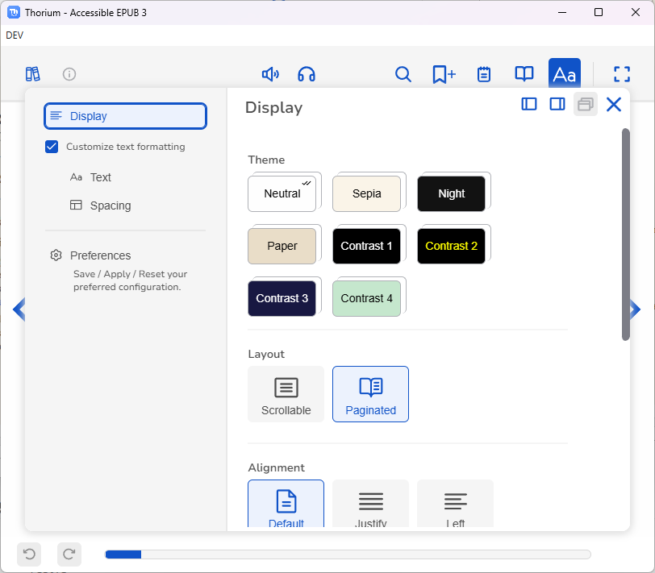


## test31 / reader settings customize text formatting persistence

- prerequisite: 
  - Test30
- steps:
  - close the reader
  - click on the publication cover - open the reader

- expected results:
  - customize text formatting checked in settings menu
  - 


## test32 / reader settings persistence library closed (fuzzy test)

- prerequisite: 
  - Test15
- steps:
  - click on the right arrow 3 times
  - open the settings menu
  - select sepia theme
  - select scrollable
  - alignment left 
  - check "customize text formating"
  - select text menu section
  - select font size to 200%
  - select spacing menu section
  - letter spacing 0.5 rem
  - close the reader
  - close the library
  - open thorium
  - click on the publication cover - open the reader

- expected results:
  - same settings before closing
  - 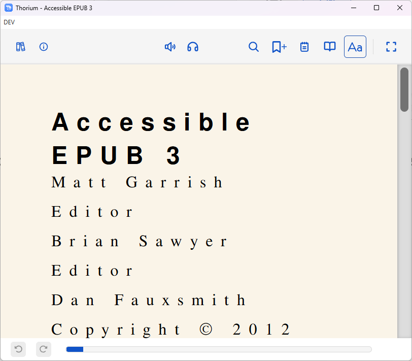


----

Test section of redux action synchronized between main and reader process

-----


## test33 / reader epub clipboard copy 

- prerequisite: 

  - Test15

- steps:

  - click 3 times on the right arrow, to get first text document
  - select "Accessible EPUB 3" heading and CTRL+C

- expected result:
  - verify the clipboard content


## test34 / reader epub config set default

- prerequisite:
  - Test32
- steps:
  - open the settings menu
  - click on preference section
  - click on reset
- expected result:
  - 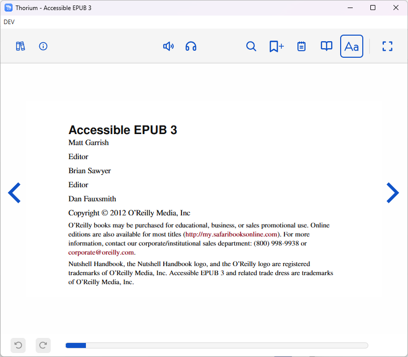


## test35 / reader fullscreen mode

- prerequisite: 

  - Test15
- steps:

  - click on the top right fullscreen icon
- expected result:
  - 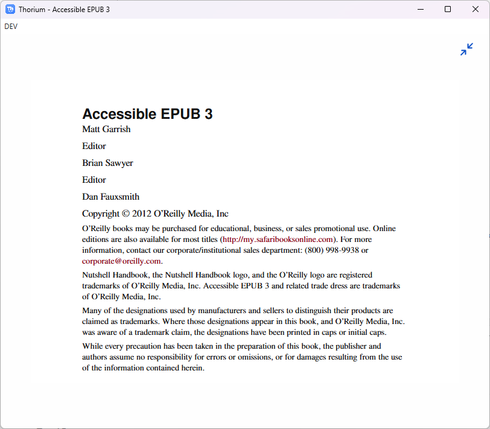


## test36 / reader change locale

- prerequisite: 

  - Test15
- steps:

  - from the library window click on settings menu
  - select language to Français (french)
  - go back to reader window
- expected results:
  - top menu bar tooltip translated in French language
  - 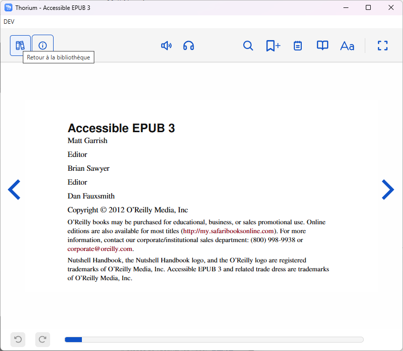


## test37 / reader change keyboard shortcut

- prerequisite: 

  - Test15
- steps:

  - from the library window click on settings menu
  - click on "Keyboard shortcuts" section
  - change "Go To Next Chapter" to CTRL + ALT + Arrow right (By default Shift + Ctrl + Alt + Arrow right)
  - click on save
  - go back to reader window
  - move the locator pointer to the head of section 3 Table of contents
  - 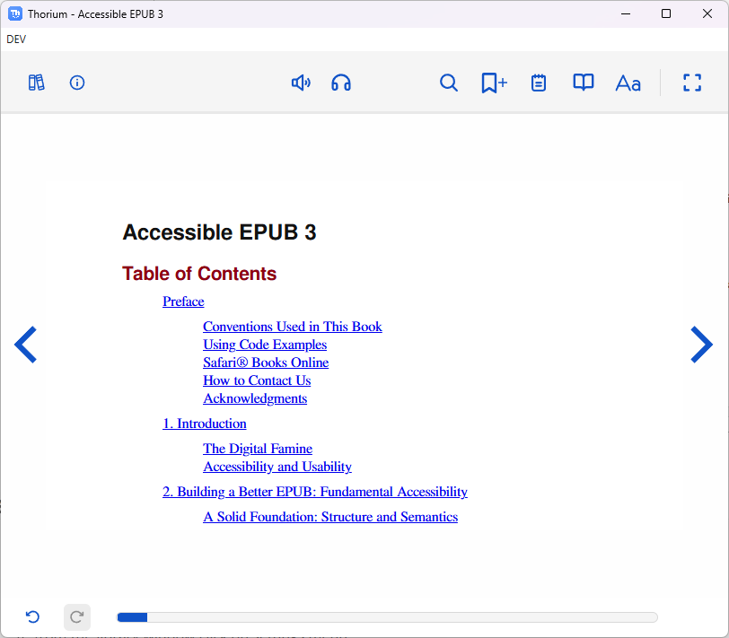
  - Apply the keyboard sequence CTRL + ALT + Arrow right
- expected results:
  - 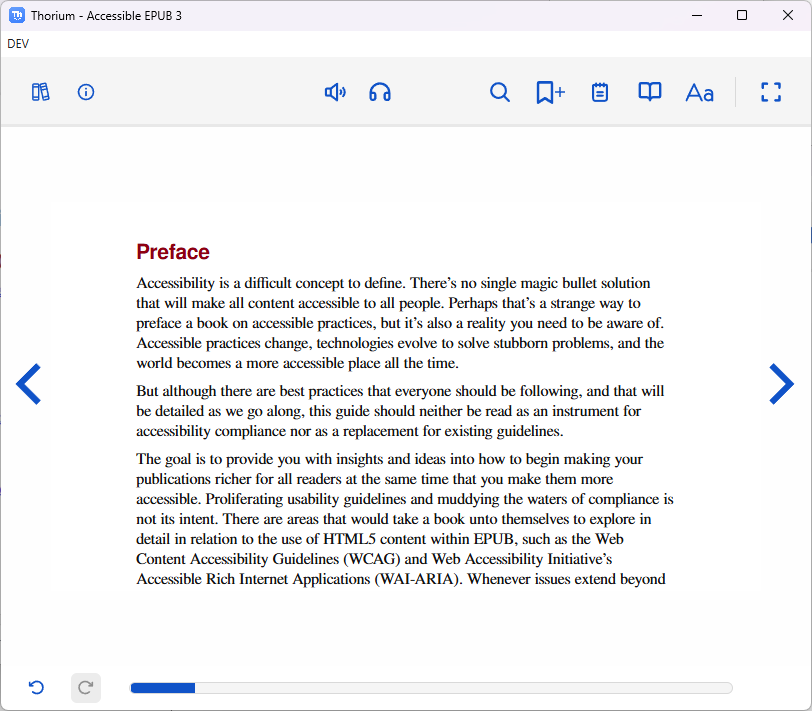


## test38 / reader reset shortcut

- prerequisite: 

  - Test37
- steps:

  - from the library window click on settings menu
  - click on "Keyboard shortcuts" section
  - click on the button "keyboard shortcuts advanced menu" menu
  - click on reset (load defaults)
  - go back to reader
  - move locator to the head of section 3 (table of contents)
  - 
  - apply shortcut CTRL+ALT+Arrow right (nothing should happen)
  - apply shortcut SHIFT+CTRL+ALT+Arrow right
- expected results:
  - 


## test 39 / reader change system theme

- prerequisite: 

  - Test15
  - light system theme
- steps:

  - from the library window
  - click on the settings button
  - click on "appearance" section menu
  - change application theme from light to dark
  - go back on reader
- expected result:
  - 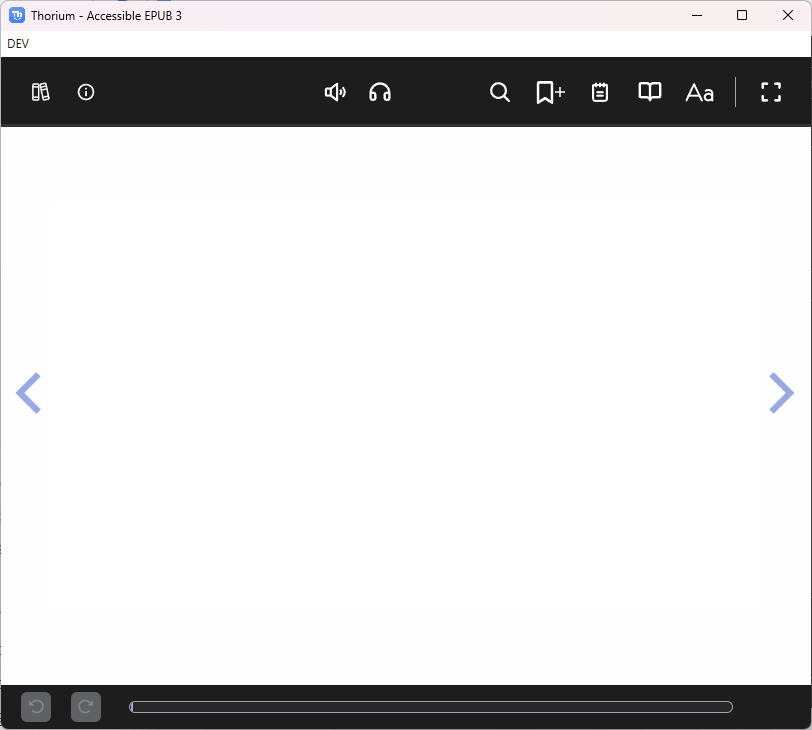


## test40 / reader epub create note

- prerequisite: 

  - Test15
- steps:
  - click 3 times on the right arrow to be at the head of the section 2
  - select "Accessible epub 3"
  - click on "annotation" button in top bar menu
  - click on save button in overlay
  - click on navigation button in top bar menu
  - select annotations section
- expected result:
  - one note listed on Accessible epub 3 heading
  - 


## test41 / reader epub note persistence

- prerequisite: 
  - Test40
- steps:
  - close the reader
  - from the library open the reader by clicking on the cover
  - the reader open
  - click on navigation button in top bar menu
  - select annotations section
- expected results:
  - the previous note is still here
  - 


## test42 / reader epub update note

- prerequisite: 
  - Test40
- steps:
  - click on the edit button in the note element
  - in comment section, enter "my comment"
  - set color to red
  - set highlight to outline
  - set tag to "hello"
  - click on save button
- expected result:
  - 


## test43 / reader epub update note persistence after library closing

- prerequisite: 
  - Test42
- steps:
  - close reader
  - go back on library and close the library window
  - start thorium
  - library window open
  - click on the publication cover
  - reader window open
  - 
  - click on navigation button in top bar menu
  - select annotations section
- expected result:
  - 


## test44 / reader epub remove note

- prerequisite: 
  - Test43
- steps:
  - click on the trash/delete icon on the note element
  - click on delete button in overlay
- expected result:
  - 


## test45 / reader epub note remove persistence

- prerequisite: 
  - Test44
- steps:
  - close the reader
  - go back on the library window
  - click on publication cover
  - reader open
  - click on navigation button in top bar menu
  - select annotations section
- expected results:
  - no notes must be listed


## test46 / reader epub note export annotation set

- prerequisite:

  - Test15

- steps:

  - move locator to the head of the second section 
  - 
  - select "Accessible EPUB 3"
  - take the note by click on "annotation" button and save
  - select "Brian Sawyer"
  - take the note by click on "annotation" button and save
  - select "Dan Fauxsmith"
  - take the note by click on "annotation" button and save
  - 
  - click on navigation button in top bar menu
  - select annotations section
  - 3 notes must be listed
  - 
  - click on "export notes" in annotations menu bar
  - 
  - enter "test46"
  - 
  - click on save notes as
  - select desktop/home folder
  - click on save on explorer finder

- expected results:

  - open test46.annotation

  - 

  - ```json
    {
      "@context": "http://www.w3.org/ns/anno.jsonld",
      "about": {
        "dc:creator": [
          "Matt Garrish"
        ],
        "dc:date": "2012-02-19T23:00:00.000Z",
        "dc:format": "application/epub+zip",
        "dc:identifier": [
          "urn:thorium:c1fd4956-2192-456b-bf8d-4a53f3c8a6bc",
          "urn:isbn:9781449328030"
        ],
        "dc:publisher": [
          "O’Reilly Media, Inc."
        ],
        "dc:title": "Accessible EPUB 3"
      },
      "generated": "2026-03-16T21:15:00.937Z",
      "generator": {
        "homepage": "https://thorium.edrlab.org",
        "id": "https://github.com/edrlab/thorium-reader/releases/tag/v3.3.1-beta.1",
        "name": "Thorium 3.3.1-beta.1",
        "type": "Software"
      },
      "id": "urn:uuid:d8e61f4e-adf2-44fd-b4aa-b2e544805f79",
      "items": [
        {
          "@context": "http://www.w3.org/ns/anno.jsonld",
          "body": {
            "color": "yellow",
            "format": "text/plain",
            "highlight": "solid",
            "tag": "",
            "type": "TextualBody",
            "value": ""
          },
          "created": "2026-03-16T21:11:36.649Z",
          "creator": {
            "id": "urn:uuid:0ab678bc-f5fe-47bb-bb22-3062ce6cbfb0",
            "name": "",
            "type": "Organization"
          },
          "id": "urn:uuid:ee822631-70b5-4a66-bc78-3c57583323d3",
          "motivation": "highlighting",
          "target": {
            "meta": {
              "headings": [
                {
                  "level": 1,
                  "txt": "Accessible EPUB 3"
                }
              ]
            },
            "selector": [
              {
                "refinedBy": {
                  "end": 13,
                  "start": 0,
                  "type": "TextPositionSelector"
                },
                "type": "CssSelector",
                "value": ".editor:nth-child(4) > .editor"
              },
              {
                "end": 109,
                "start": 96,
                "type": "TextPositionSelector"
              },
              {
                "exact": "Dan Fauxsmith",
                "prefix": "",
                "suffix": "",
                "type": "TextQuoteSelector"
              },
              {
                "type": "ProgressionSelector",
                "value": 0.1984978540772532
              },
              {
                "conformsTo": "http://www.idpf.org/epub/linking/cfi/epub-cfi.html",
                "type": "FragmentSelector",
                "value": "epubcfi(/6/4!/4/2[I_book_d1e1]/8/4,/2/1:0,/4/1:9)"
              },
              {
                "type": "CfiSelector",
                "value": "/4/2[I_book_d1e1]/8/4,/2/1:0,/4/1:9"
              }
            ],
            "source": "EPUB/index.xhtml"
          },
          "type": "Annotation"
        },
        {
          "@context": "http://www.w3.org/ns/anno.jsonld",
          "body": {
            "color": "yellow",
            "format": "text/plain",
            "highlight": "solid",
            "tag": "",
            "type": "TextualBody",
            "value": ""
          },
          "created": "2026-03-16T21:11:22.436Z",
          "creator": {
            "id": "urn:uuid:0ab678bc-f5fe-47bb-bb22-3062ce6cbfb0",
            "name": "",
            "type": "Organization"
          },
          "id": "urn:uuid:c99ebf8d-ce52-4101-a41e-6af3e2afb8f4",
          "motivation": "highlighting",
          "target": {
            "meta": {
              "headings": [
                {
                  "level": 1,
                  "txt": "Accessible EPUB 3"
                }
              ]
            },
            "selector": [
              {
                "refinedBy": {
                  "end": 12,
                  "start": 0,
                  "type": "TextPositionSelector"
                },
                "type": "CssSelector",
                "value": ".editor:nth-child(3) > .editor"
              },
              {
                "end": 72,
                "start": 60,
                "type": "TextPositionSelector"
              },
              {
                "exact": "Brian Sawyer",
                "prefix": "",
                "suffix": "",
                "type": "TextQuoteSelector"
              },
              {
                "type": "ProgressionSelector",
                "value": 0.13841201716738197
              },
              {
                "conformsTo": "http://www.idpf.org/epub/linking/cfi/epub-cfi.html",
                "type": "FragmentSelector",
                "value": "epubcfi(/6/4!/4/2[I_book_d1e1]/6/4,/2/1:0,/4/1:6)"
              },
              {
                "type": "CfiSelector",
                "value": "/4/2[I_book_d1e1]/6/4,/2/1:0,/4/1:6"
              }
            ],
            "source": "EPUB/index.xhtml"
          },
          "type": "Annotation"
        },
        {
          "@context": "http://www.w3.org/ns/anno.jsonld",
          "body": {
            "color": "yellow",
            "format": "text/plain",
            "highlight": "solid",
            "tag": "",
            "type": "TextualBody",
            "value": ""
          },
          "created": "2026-03-16T21:11:04.588Z",
          "creator": {
            "id": "urn:uuid:0ab678bc-f5fe-47bb-bb22-3062ce6cbfb0",
            "name": "",
            "type": "Organization"
          },
          "id": "urn:uuid:b8a2d5f2-56f5-4f79-a4cc-b1bb83abd86a",
          "motivation": "highlighting",
          "target": {
            "meta": {
              "headings": [
                {
                  "level": 1,
                  "txt": "Accessible EPUB 3"
                }
              ]
            },
            "selector": [
              {
                "refinedBy": {
                  "end": 17,
                  "start": 0,
                  "type": "TextPositionSelector"
                },
                "type": "CssSelector",
                "value": ".title"
              },
              {
                "end": 24,
                "start": 7,
                "type": "TextPositionSelector"
              },
              {
                "exact": "Accessible EPUB 3",
                "prefix": "\n\t\t\t",
                "suffix": "\n",
                "type": "TextQuoteSelector"
              },
              {
                "type": "ProgressionSelector",
                "value": 0.04291845493562232
              },
              {
                "conformsTo": "http://www.idpf.org/epub/linking/cfi/epub-cfi.html",
                "type": "FragmentSelector",
                "value": "epubcfi(/6/4!/4/2[I_book_d1e1]/2/1,:0,:17)"
              },
              {
                "type": "CfiSelector",
                "value": "/4/2[I_book_d1e1]/2/1,:0,:17"
              }
            ],
            "source": "EPUB/index.xhtml"
          },
          "type": "Annotation"
        }
      ],
      "title": "test46",
      "type": "AnnotationSet"
    }
    ```

  - 


## test47 / reader epub notes import annotation set

- prerequisite:
  - Test46
- steps:
  - from reader window
  - click on delete/trash button on note list menu bar
  - 
  - click on Yes
  - click on import notes button on note menu bar
  - select "test46.annotation"
  - 
  - click on import all notes button
- expected result:
  - same 3 notes from before with this time the new import tag: test46
  - 


## test48 / reader epub 

- prerequisite:
  - Test15
- steps:
  - go back on library window
  - click on settings button 
  - from annotation creator section insert "test48" as creator name
  - close the settings modal by click on the cross in top right
  - go back on reader window
  - move locator to the head of section2
  - 
  - select "Accessible EPUB 3"
  - take a note by click on annotation button in top bar and click on save
  - click on navigation button in top bar menu
  - select annotations section
- expected result:
  - one note with "test48" as creator
  - 


## test49 / reader epub rtlflip persistence

> specific test for rtlflip action  on epub reader

- prerequisite:
  - Test15
- steps:
  - click on settings button in top bar menu
  - check/enable "Disable Right-To-Left UI"
  - 
  - close the reader
  - go back on library window
  - click on the publication cover
  - reader open
  - click on settings button in top bar menu
- expected result:
  - check if the checkbox "Disable Right-To-Left UI" is checked/enabled
  - 


## test 50 / reader divina reading mode persistence

- prerequisite:
  - publication: PerrerAndCarrot.divina
- steps:
  - from library window import the publication PerrerAndCarrot.divina
  - 
  - click on the publication cover
  - open the reader
  - 
  - click on settings button in top bar menu
  - from layout section click on guided (single currently selected)
  - 
  - close the reader
  - go back on library window and click on the publication cover
  - click on settings button in top bar menu
  - from layout section guided must be selected instead of single
  - close the reader
  - close the library 
  - start thorium
  - library window open
  - click on the publication cover
  - reader open
  - click on settings button in top bar menu
- expected result:
  - from layout section guided must be selected instead of single
  - 


## test 51 / reader pdf config persistence

- prerequisite:
  - publication: canada_const.pdf
- steps:
  - from library window import the publication canada_const.pdf
  - 
  - click on the publication cover
  - open the reader
  - 
  - click on settings button in top bar menu
  - select 200% zoom from zoom section
  - click on Display section
  - select 2 cols
  - click on the page spreads checkbox
  - close the reader
  - close the library
  - start thorium 
  - start thorium
  - library window open
  - click on the publication cover
  - reader open
  - click on settings button in top bar menu
- expected results:
  - pdf config correctly persisted and hydrated


## test52 / reader epub allowCustom checkbox persistence

- prerequisite: 
  - Test15
- steps:
  - click on the settings icon in top right
  -  
  - close reader
  - close library
  - start thorium
  - library window open
  - click on the publication cover
  - reader open
  - click on the settings icon in top right
- expected result:
  - "customize text formating" checkbox must be checked/enabled
  - 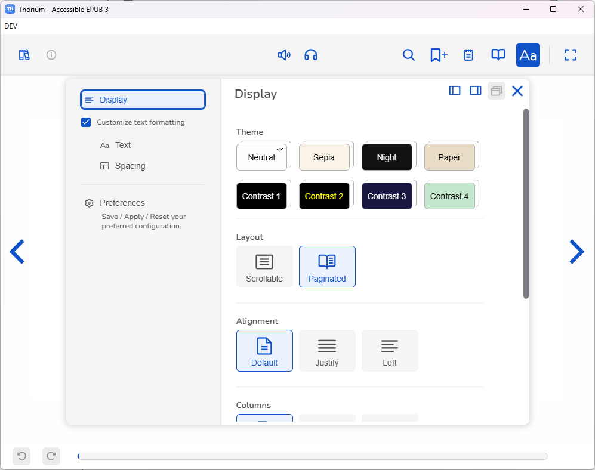


