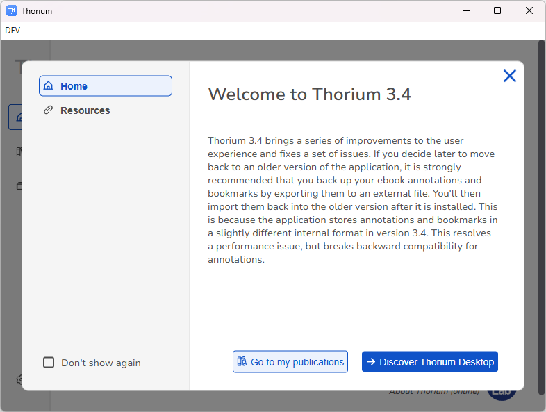
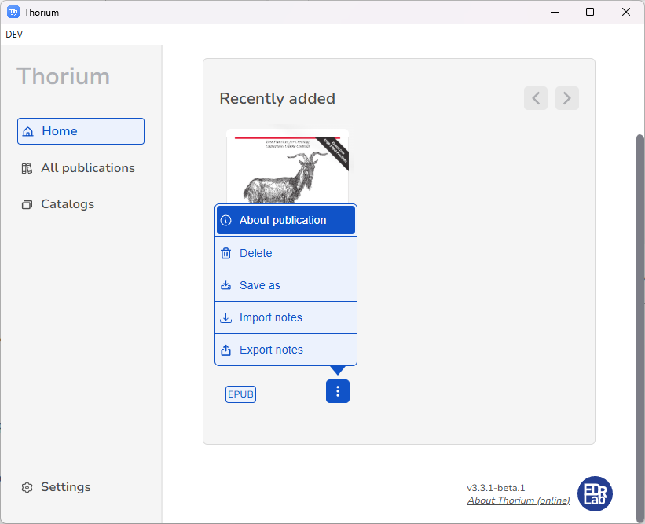
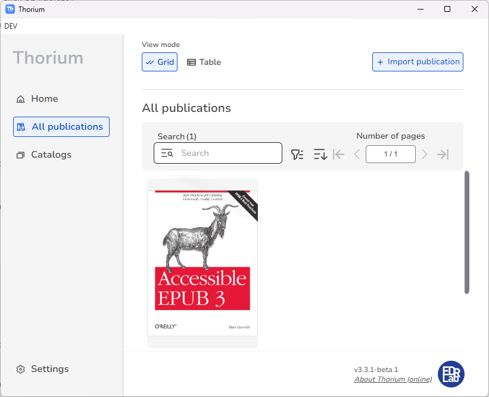
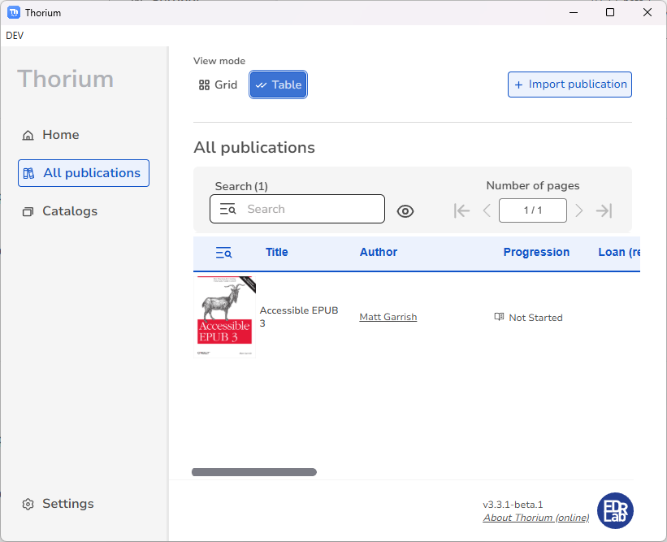
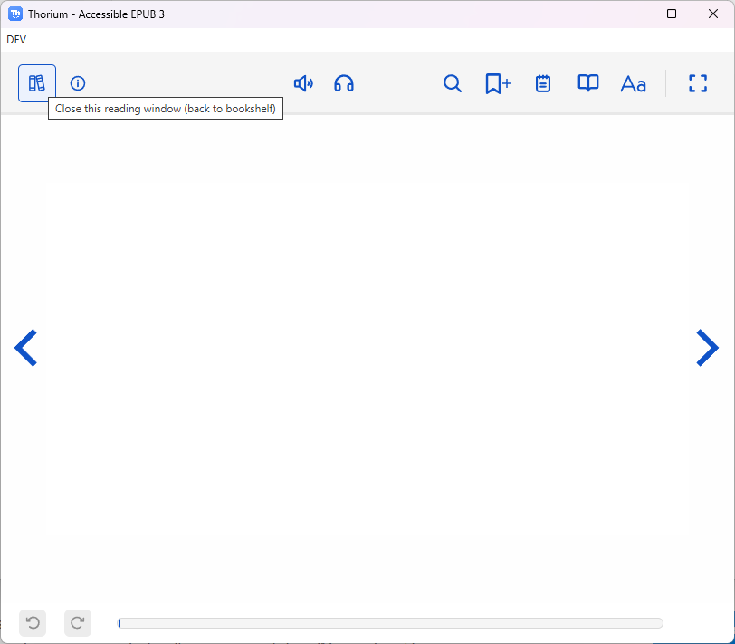
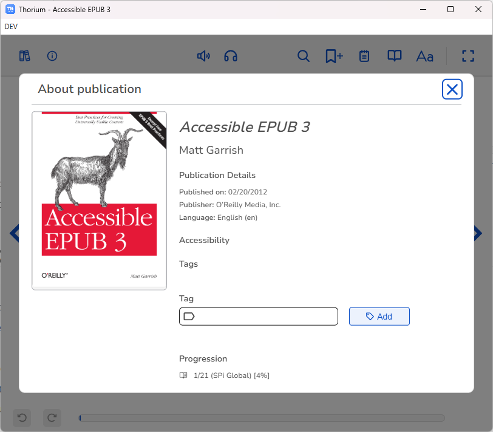
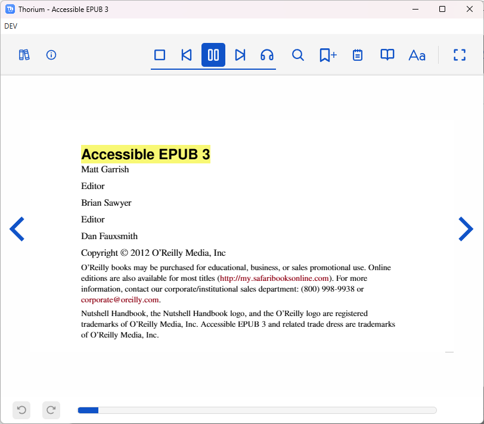
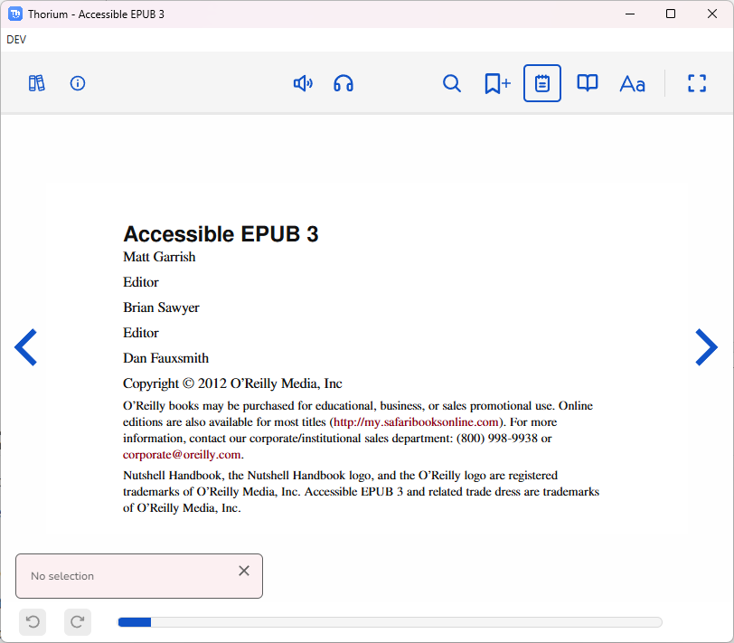
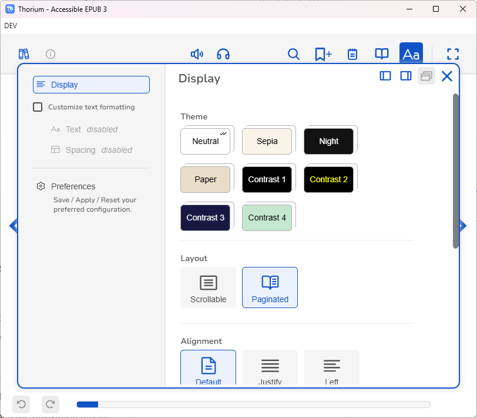

# test-suite 

Thorium test suite 

## test 1 / library open with wizard welcome screen

- name: open library window

- platforms: win

- version: 3.4

- goal: open electron library browser window

- prerequisite: 

  - appData cleared

- steps: 

  * start thorium

- expected result:

  welcome screen Thorium 3.4

- post steps: 
  - click on Don't show again
    - 
  - click on Go to my publication
- expected results: 

## test 2 / library menu navigation

- prerequisite: Test1
- steps:
  - start thorium

- expected result:
  - All publications
    -  
  - All catalogs
    -  
  - Settings
    - 

## test3 / library home "import a publication"

- prerequisite: 

  - Test1
  - [accessible_epub_3.epub](accessible_epub_3.epub) 

- steps:

  -  click on "import publication"
  - select accessible epub3 epub file

- expected result:

  - import the publication

    

## test4 / publication catalog menu

- prerequisite: 
  - Test3
- steps:
  - click on the publication catalog menu icon (3 vertical small points)
- expected result:
  - catalog menu overlay

## test5 / library about publication modal

- prerequisite: 
  - Test4
- steps:
  - click on "About publication"

## test6 / library about publication / read

- prerequisite: 

  - Test5

- steps:

  - click on "Read"

- expected result:

  - open the reader browser window

    

  - library window is still open in background

## test7 / library about publication / delete

- prerequisite: 

  - Test5

- steps:

  - click on "Delete"

    

- expected results:

  - Click on Cancel dismiss the Delete publication modal and do nothing
  - Click on Yes remove the publication and come back to home library
    - v

## test8 / library about publication / save as

- prerequisite: 
  - Test5
- steps:
  - click on "save as"
- expected results: 
  - open the file explorer to export the publication to a specific file pathname
  - select a temporary directory
  - export the publication
  - check if the publication is exported to the disk

## test9 / library catalog menu / delete

- prerequisite: 
  - Test4
- steps:
  - click on "delete"

- expected results: 
  - same expected results as test7 

## test10 / library catalog menu / save as

- prerequisite: 
  - Test4
- steps:
  - click on "save as"

- expected results: 
  - same expected results as test8

## test11 / library all publications / one publication

- prerequisite: 
  - Test3
- steps:
  - click on "All publication" on the left menu section
- expected results:
  - 

## test12 / library all publications 

- prerequisite: 
  - Test11
- steps:
  - click on the catalog menu of the publication
- expected results:
  - same as Test4 catalog menu tests

## test13 / library all publications table view

- prerequisite: 

  - Test11

- steps:

  - click on Table on the top menu, grid must be selected by default

- expected results:

  - same as Test4 catalog menu tests

    

## test15 / one reader with "accessible epub3" opened

- prerequisite: 

  - Test3

- steps:

  - click on the accessible epub 3 publication cover

- expected result:

  - open the reader browser window with the library window in background hided by the reader window

    

## test16 / reader back to bookshelf

- prerequisite: 
  - Test15
- steps:
  - click on the back to bookshelf menu button

-  expected result:
  - close the reader and focus on library window

## test17 / reader publication info

- prerequisite: 

  - Test15

- steps:

  - click on the publication info icon in top left corner

- expected results:

  - publication info modal

    

## test18 / reader start tts

- prerequisite: 
  - Test15
- steps:
  - click on the activate tts icon in top middle
- expected results:
  - display tts buttons in place of activate tts icon 

## test19 / reader tts options

- prerequisite: 
  - Test15
- steps:
  - click on the options tts icon in top middle
- expected results:
  - display tts options overlay menu
  - 

## test20 / reader search publication

- prerequisite: 
  - Test15
- steps:
  - click on the search publication icon in top right
- expected results:
  - display search bar on top of the publication content
  - 

## test21 / reader bookmark

- prerequisite: 
  - Test15
- steps:
  - click on the bookmark icon in top right
- expected results:
  - bookmark the first locator position on the publication content 
  - 

## test22 / reader note

- prerequisite: 
  - Test15
- steps:
  - click on the note icon in top right
- expected results:
  - dispatch a toast error notification with "no selection"
  - 

## test23 / reader navigation

- prerequisite: 
  - Test15
- steps:
  - click on the navigation icon in top right
- expected results:
  - open the navigation modal 
  - 

## test24 / reader settings

- prerequisite: 
  - Test15
- steps:
  - click on the settings icon in top right
- expected results:
  - open the navigation modal 
  - 

## test25 / reader locator change

- prerequisite: 
  - Test18
- steps:
  - click on the right arrow

- expected results:
  - page change
  - 

## test26 / reader locator persistence

- prerequisite: 
  - Test25
- steps:
  - close the reader
  - click on the publication cover - open the reader

- expected results:
  - locator didn't change and stay on the same previous page
  - 

## test27 / reader settings theme change

- prerequisite: 
  - Test24
- steps:
  - select sepia theme
  - close the settings modal

- expected results:
  - theme change to sepia
  - 

## test29 / reader settings theme persistence

- prerequisite: 
  - Test27
- steps:
  - close the reader

- expected results:
  - theme didn't change and stay on sepia
  - 

## test30 / reader settings customize text formatting

- prerequisite: 
  - Test15
- steps:
  - open the settings modal
  - check "customize text formatting"

- expected results:
  - Text and Spacing menu section enabled 
  - 

## test31 / reader settings customize text formatting persistence

- prerequisite: 
  - Test30
- steps:
  - close the reader
  - click on the publication cover - open the reader

- expected results:
  - customize text formatting checked in settings menu
  - 

## test32 / reader settings persistence library closed (fuzzy test)

- prerequisite: 
  - Test15
- steps:
  - click on the right arrow 3 times
  - open the settings menu
  - select sepia theme
  - select scrollable
  - alignment left 
  - check "customize text formating"
  - select text menu section
  - select font size to 200%
  - select spacing menu section
  - letter spacing 0.5 rem
  - close the reader
  - close the library
  - open thorium
  - click on the publication cover - open the reader

- expected results:
  - same settings before closing
  - 

